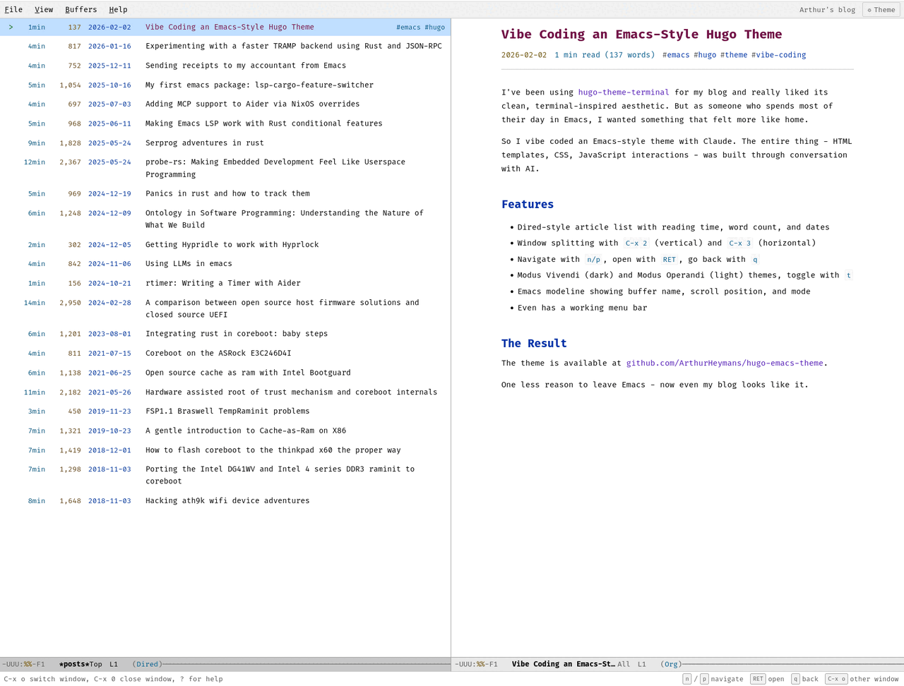

# Emacs Hugo Theme

A Hugo theme that transforms your blog into an Emacs-like experience with buffer management, keyboard navigation, and authentic styling.



## Features

- **Full-screen buffer view** - Article list and content displayed like Emacs buffers
- **Window splitting** - Side-by-side (C-x 3) or stacked (C-x 2) layouts
- **Emacs keybindings** - Navigate with n/p, open with RET, quit with q
- **Dired-style article list** - Shows reading time, word count, date
- **Modus themes** - Vivendi (dark) and Operandi (light) with `t` to toggle
- **Emacs modeline** - Buffer name, scroll position, major mode indicator
- **Menu bar** - File, View, Buffers, Help dropdowns
- **Echo area** - Shows keyboard hints and messages
- **Mobile responsive** - Adapts to single-buffer view on small screens

## Installation

1. Clone or copy this theme to your Hugo site's `themes/` directory:

```bash
cd your-hugo-site
git submodule add https://github.com/ArthurHeymans/hugo-emacs-theme themes/emacs
```

2. Update your `config.toml`:

```toml
theme = "emacs"

[markup.highlight]
noClasses = false
```

3. Run Hugo:

```bash
hugo server -D
```

## Keyboard Shortcuts

### Navigation (List Buffer)

| Key | Action |
|-----|--------|
| `n` / `↓` | Next article |
| `p` / `↑` | Previous article |
| `RET` / `o` | Open article |
| `<` | Beginning of list |
| `>` | End of list |

### Navigation (Content Buffer)

| Key | Action |
|-----|--------|
| `n` / `p` | Scroll down/up (split mode) or next/prev article (single mode) |
| `↓` / `↑` | Scroll down/up |
| `PgDn` / `PgUp` | Page down/up |
| `SPC` / `S-SPC` | Page down/up |
| `C-v` / `M-v` | Page down/up (Emacs style) |
| `<` / `>` | Beginning/end of article |
| `q` | Go back to list |

### Window Management

| Key | Action |
|-----|--------|
| `C-x 3` | Split horizontal (side by side) |
| `C-x 2` | Split vertical (stacked) |
| `C-x 0` | Close current window |
| `C-x 1` | Close other windows |
| `C-x o` / `Tab` | Switch to other window |

### View

| Key | Action |
|-----|--------|
| `t` | Toggle dark/light theme |
| `+` | Increase font size |
| `-` | Decrease font size |
| `?` | Show help overlay |
| `C-g` / `Esc` | Quit/cancel |

## Theme Customization

### Colors

The theme uses Modus Vivendi (dark) and Modus Operandi (light) color schemes. Colors are defined as CSS custom properties in `assets/css/themes.css`.

### Fonts

The theme uses Fira Code as the monospace font. Font files are included in `static/fonts/`. To use a different font, update the `@font-face` declarations in `assets/css/main.css`.

## File Structure

```
themes/emacs/
├── assets/
│   ├── css/
│   │   ├── echo-area.css    # Echo area styling
│   │   ├── main.css         # Core layout, typography
│   │   ├── menu-bar.css     # Menu bar dropdowns
│   │   ├── mobile.css       # Responsive design
│   │   ├── modeline.css     # Emacs modeline
│   │   ├── syntax.css       # Code highlighting
│   │   ├── themes.css       # Modus color schemes
│   │   └── windows.css      # Buffer/window styling
│   └── js/
│       ├── keyboard.js      # Keyboard navigation
│       ├── menu.js          # Menu interactions
│       └── windows.js       # Window management
├── layouts/
│   ├── _default/
│   │   ├── baseof.html      # Base template
│   │   ├── list.html        # List pages
│   │   ├── single.html      # Article pages
│   │   └── terms.html       # Taxonomy pages
│   ├── partials/
│   │   ├── echo-area.html   # Echo area partial
│   │   ├── head.html        # HTML head
│   │   ├── help-overlay.html# Help modal
│   │   ├── menu-bar.html    # Menu bar
│   │   └── modeline.html    # Modeline partial
│   ├── 404.html             # Error page
│   └── index.html           # Homepage
├── static/
│   └── fonts/               # Fira Code font files
├── theme.toml               # Theme metadata
└── README.md
```

## Browser Support

- Modern browsers (Chrome, Firefox, Safari, Edge)
- Keyboard navigation requires JavaScript
- Graceful degradation for older browsers

## Vibe Coded

This theme was fully vibe coded with [Claude](https://claude.ai) (Anthropic's AI assistant). The entire theme - HTML templates, CSS styling, JavaScript interactions, and documentation - was created through conversational AI-assisted development.

## Credits

- Color schemes based on [Modus Themes](https://protesilaos.com/emacs/modus-themes) by Protesilaos Stavrou
- Font: [Fira Code](https://github.com/tonsky/FiraCode) by Nikita Prokopov
- Inspired by GNU Emacs

## License

Dual-licensed under [MIT](LICENSE) or [Apache 2.0](LICENSE), at your option.
